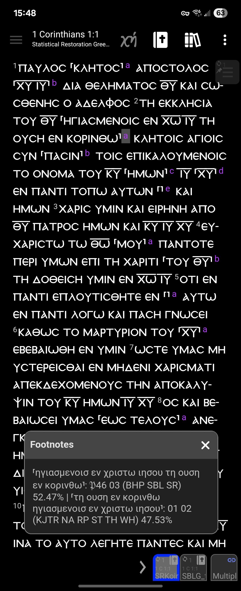
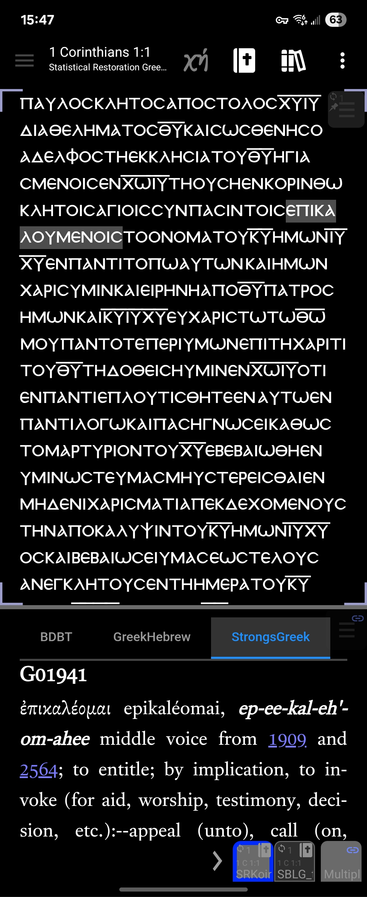
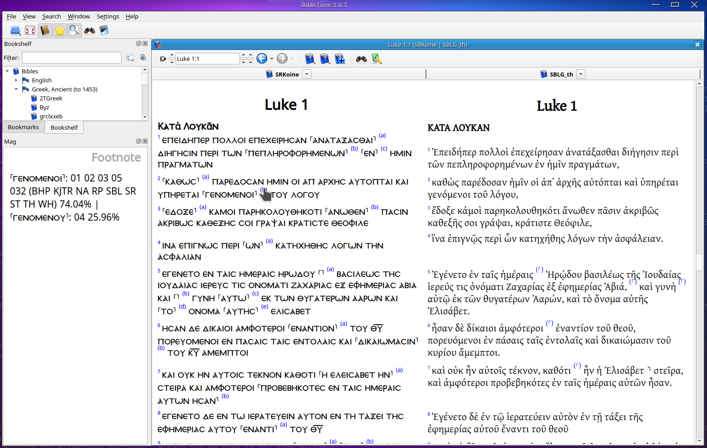
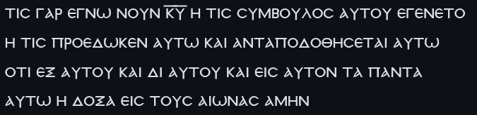

# SRKoine Sword Module

This is the Koine version of the 2022 Statistical Restoration (SR) Greek New Testament with Apparatus by Alan Bunning and the  [Center for New Testament Restoration](https://greekcntr.org/home/index.html) (CNTR) converted to a SWORD module for use in Bible reading apps that use the [SWORD engine](https://www.crosswire.org/sword/index.jsp) and library.  To be as authentic as possible to our oldest manuscripts, this module uses Koine spelling, nomina sacra abbreviations with an overline, no accents, no punctuation and no paragraph breaks.  Words are tagged with Strongs numbers and Robinson's morphological codes, converted from Bunning's "expanded Strongs numbers" and morphological codes, in order to be compatible with SWORD dictionary modules.  Please let me know if you find mistakes.

## Setup:

Load SRKoine.zip into your favourite SWORD-based app.  If it doesn't take zip files, just unzip it, and copy the contents of mods.d and modules to the corresponding folders in your .sword directory.  For example, on the AndBible app, they should be copied to "Internal storage/Android/data/net.bible.android.activity/files/".

## Koine Font:

For an even more authentic Koine experience, read this with the KoineGreekPlus font in the fonts directory.  This font is the same as the [CNTR Koine font](https://github.com/Center-for-New-Testament-Restoration/font) but has a longer overline for nomina sacra and detaches the Koine glyphs from the Latin characters so you can write notes in English with the same font.  And if you want the full papyrus experience, try the KoineGreekPapyrus font which eliminates spaces between words like in papyri!  It's great training for reading real papyri (or just great fun for nerds like me).

## Screenshots for AndBible:

<table width=50%>
  <tr>
    <td>1 Cor. 1 using the KoineGreekPlus font.  The apparatus is shown for footnote a in verse 2.  </td>
    <td>1 Cor. 1 in full "Papyrus mode" using the KoineGreekPapyrus font.  In AndBible, I also disabled footnotes, chapter & verse numbers and justify-align to get it to look like this.  Note how επικαλουμενοισ breaks and continues on the next line like in a real papyrus (but the line breaks will depend on your font size).  Strong's dictionary entry is shown for that word.</td>
  </tr>
  <tr>
    <td width=50%></td>
    <td width=50%></td>
  </tr>
</table>

## Screenshots for BibleTime:
<table width=50%>
  <tr>
    <td>BibleTime comparing SRKoine and SBLG_th.</td>
  </tr>
  <tr>
    <td width=50%></td>
  </tr>
</table>

## Apparatus: 

The apparatus is provided in footnotes.  Symbols and abbreviations correspond to CNTR's [Apparatus tool](https://greekcntr.org/apparatus/index.html).  The apparatus and SR are constantly updated at the CNTR.  While the main text is the [2022 public version of the SR](https://github.com/Center-for-New-Testament-Restoration/SR), the apparatus data were kindly provided by Alan Bunning on May 23, 2026 and reflect an updated version of the SR on that date.  I made every effort to programatically match the notes with the correct words despite the mismatched versions.  Please let me know if you find mistakes.  

## Having trouble reading Koine spelling?

Try learning Dr. Randall Buth's [phonemic pronunciation system](https://www.biblicallanguagecenter.com/koine-greek-pronunciation/) which treats certain letters as the same sound (phoneme) based on spelling variations in the 1st century.  I know from personal experience that his pronunciation and living language method will make reading SRKoine more natural because you will have internalized which letters sound the same.

## Note for AndBible users:

There's a bug in at least v5.1.1091 where changing fonts on Ancient Greek documents (lang=grc) has no effect. Until that bug is fixed, try this hack to get the Koine font to work: plug your phone into your computer and open the new drive that appears (you might have to tap "Allow" on your phone). Navigate to "Internal storage/Android/data/net.bible.android.activity/files/mods.d".  Open SRKoine.conf with a text editor.  Look for "Lang=grc" and change that to "Lang=el".  Restart AndBible and enjoy reading in Koine font!

## About the SR:

The 2022 SR is "the first computer-generated text derived directly from the earliest manuscript witnesses using an algorithmic statistical model to simulate a reasoned-eclecticism approach, weighing both external and internal evidence in an objective manner."  Citation: Bunning, Alan, ed. *Statistical Restoration Greek New Testament*. Center for New Testament Restoration. 2022.  For more information see their [website](https://greekcntr.org/home/index.html).

[Text Source](https://github.com/Center-for-New-Testament-Restoration/SR) Owning organisation: Center for New Testament Restoration / Statistical Restoration Greek New Testament

## Copyright information

### The 2022 SR Greek New Testament
Copyright © 2022 by Alan Bunning released under the [Creative Commons Attribution 4.0 International License (CC BY 4.0)](http://creativecommons.org/licenses/by/4.0/). Attribution must be given to Alan Bunning and the [Center for New Testament Restoration](http://greekcntr.org), and any derivative work must likewise require that this attribution be included along with their own in any subsequent derivative works.

Changes made by Joanna Woo:
- Expanded Strong's Numbers converted to standard Strong's (for compatibility with SWORD dictionary modules)
- Morphological codes converted to Robinson's (for compatibility with SWORD module Robinson)
- Added apparatus data kindly provided by Alan Bunning on May 23, 2026, distributed in this module with permission.

## And last but not least, the most important credit:

